# Chapter 2: Working with Particle primitives & Grove Sensors

| **Project Goal**            | Start programming your Argon, read sensor data, and leverage the device cloud.                         |
| --------------------------- | --------------------------------------------------------------------------------------------------------- |
| **What you’ll learn**       | How to interact with sensors, using Particle variables, cloud functions and publish/subscribe.                               |
| **Tools you’ll need**       | Access to the internet for build.particle.io and console.particle.io. Plus the Particle CLI, Particle Workbench, a Particle Argon, and Grove Starter Kit for Particle Mesh |
| **Time needed to complete** | 60 minutes                                                                                                |

In this session, you'll explore the Particle ecosystem via an Argon-powered Grove Starter Kit for Particle Mesh with several sensors! If you get stuck at any point during this session, [click here for the completed, working source](https://go.particle.io/shared_apps/5d40ad9e279e1e000b9ad55f).

## Create a new project in Particle Workbench

1. Open Particle Workbench (VS Code) and click "Create new project."

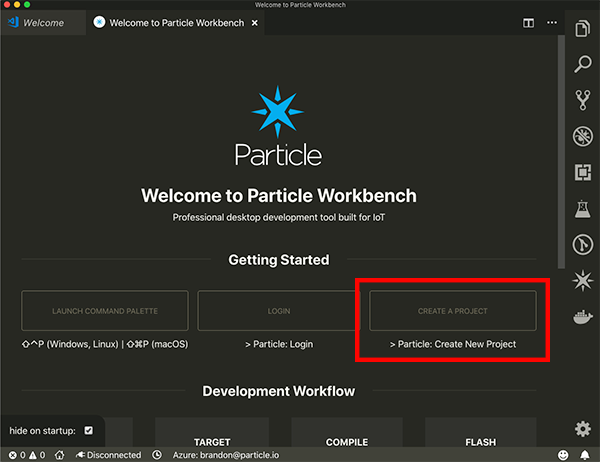

2. Select the parent folder for your new project and click the "Choose project's parent folder" button.

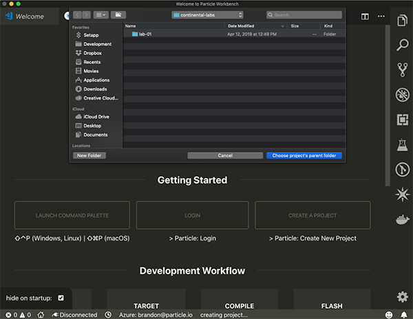

3. Give the project a name and hit "Enter."

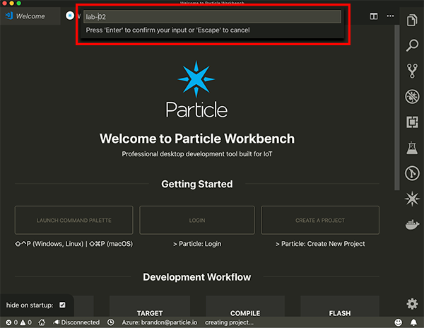

3. Click "ok" when the create project confirmation dialog pops up.

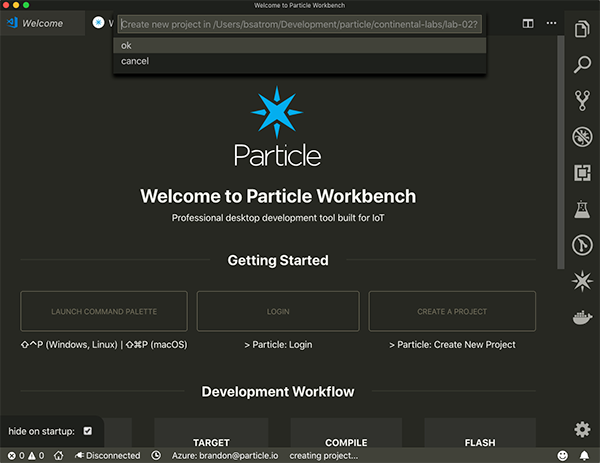

4. Once the project is created, the main `.ino` file will be opened in the main editor. Before you continue, let's take a look at the Workbench interface.

### Using the command palette and quick buttons

1. To open the command palette, type CMD (on Mac) or CTRL (on Windows) + SHIFT + P and type "Particle." To see a list of available Particle Workbench commands. Everything you can do with Workbench is in this list.

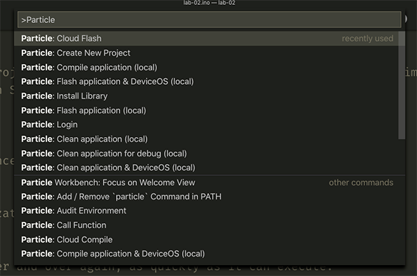

2. The top nav of Particle Workbench also includes a number of handy buttons. From left to right, they are Compile (local), Flash (local), call function, and get variable.

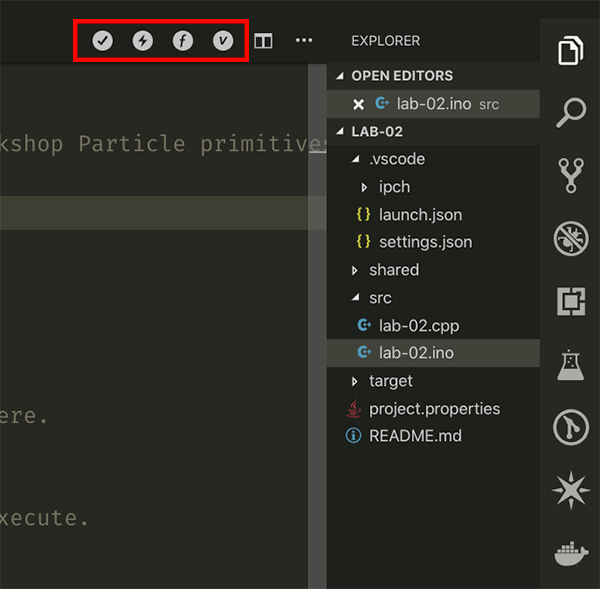

### Configuring the workspace for your device

1. Before you can flash code to your device, you need to configure the project with a device type, Device OS firmware version, and device name. Open the command palette and select the "Configure Project for Device" option.

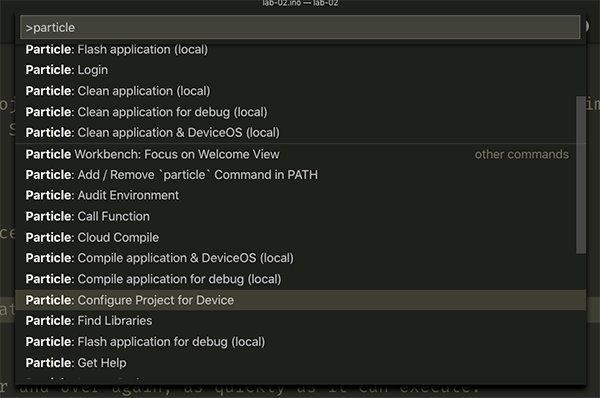

2. Choose a Device OS version. For this lab, you should use 1.1.0 or newer.

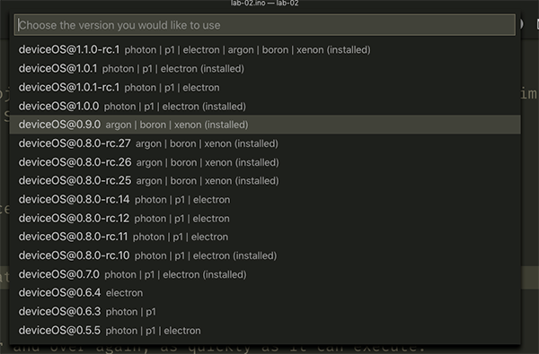

3. Select the "Argon" as your target platform.


4. Enter the name of your device and hit "Enter."


You're now ready to program your Argon with Particle Workbench. Let's get the device plugged into your Grove kit and start working with sensors.

## Unboxing the Grove Starter Kit

The Grove Starter Kit for Particle Mesh comes with seven different components that work out-of-the-box with Particle Mesh devices, and a Grove Shield that allows you to plug in your Feather-compatible Mesh devices for quick prototyping. The shield houses eight Grove ports that support all types of Grove accessories. For more information about the kit, [click here](https://docs.particle.io/datasheets/accessories/mesh-accessories/#grove-starter-kit-for-particle-mesh).

For this lab, you'll need the following items from the kit:

- Temperature and Humidity Sensor
- Chainable LED
- Light Sensor

1. Open the Grove Starter Kit and remove the three components listed above, as well as the bag of Grove connectors.

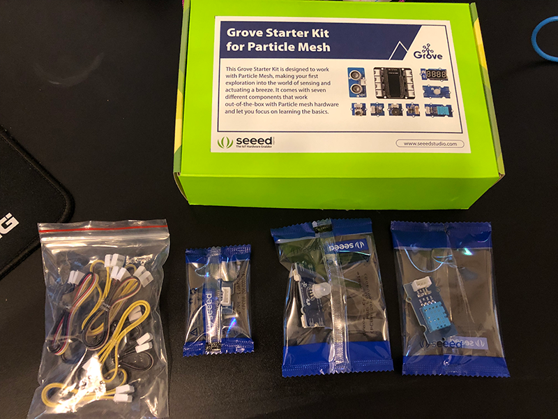

2. Remove the Grove Shield and plug in your Argon. This should be the same device you claimed in the last lab.

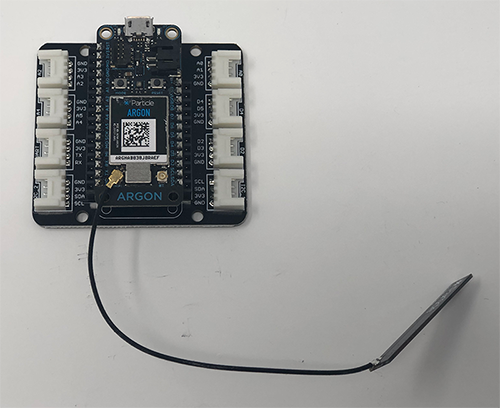

Now, you're ready to start using your first Grove component!

## Working with Particle Variables plus the Temperature & Humidity Sensor

The Particle Device OS provides a simple way to access sensor values and device local state through the [variable primitive](https://docs.particle.io/reference/device-os/firmware/argon/#particle-variable-). Registering an item of firmware state as a variable enables you to retrieve that state from the Particle Device Cloud. Let's explore this now with the help of the Grove Temperature and Humidity sensor.

### Connect the Temperature sensor

To connect the sensor, connect a Grove cable to the port on the sensor. Then, connect the other end of the cable to the `D2` port on the Grove shield.

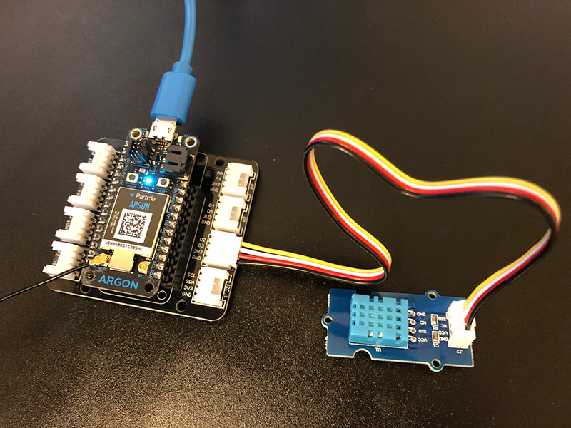

### Install the sensor firmware library

To read from the temperature sensor, you'll use a firmware library, which abstracts away many of the complexities of dealing with this device. That means you don't have to reading from the sensor directly or dealing with conversions, and can instead call functions like `getHumidity` and `getTempFarenheit`.

1. Open your Particle Workbench project and activate the command palette (CMD/CTRL+SHIFT+P).

2. Type "Particle" and select the "Install Library" option

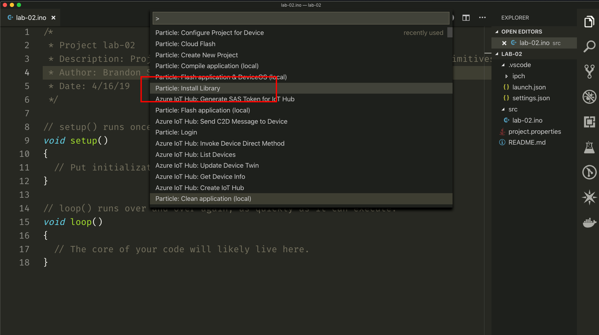

3. In the input, type "Grove_Temperature_And_Humidity_Sensor" and click enter.


You'll be notified once the library is installed, and a `lib` directory will be added to your project with the library source.

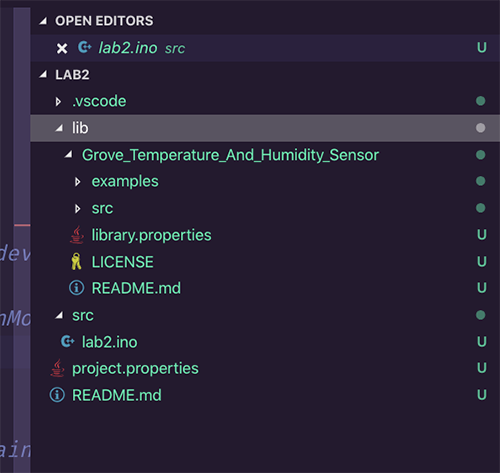

### Read from the sensor

1. Once the library is installed, add it to your project via an `#include` statement at the top of your main project file (`.ino` or `.cpp`).

```cpp
#include "Grove_Temperature_And_Humidity_Sensor.h"
```

2. Next, initialize the sensor, just after the `#include` statement.

```cpp
DHT dht(D2);
```

3. In the `setup` function, you'll initialize the sensor and a serial monitor:

```cpp
void setup()
{
  Serial.begin(9600);

  dht.begin();
}
```

4. Finally, take the readings in the `loop` function and write them to the serial monitor.

```cpp
void loop()
{
  int temp, humidity;

  temp = (int)dht.getTempFarenheit();
  humidity = (int)dht.getHumidity();

  Serial.printlnf("Temp: %f", temp);
  Serial.printlnf("Humidity: %f", humidity);

  delay(10000);
}
```

6. Now let's flash this code to your device. Open the command palette (CMD/CTRL+SHIFT+P) and select the "Particle: Cloud Flash" option

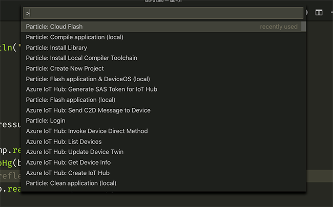

7. Finally, open a terminal window and run the `particle serial monitor` command. Once your Argon comes back online, it will start logging environment readings to the serial console.

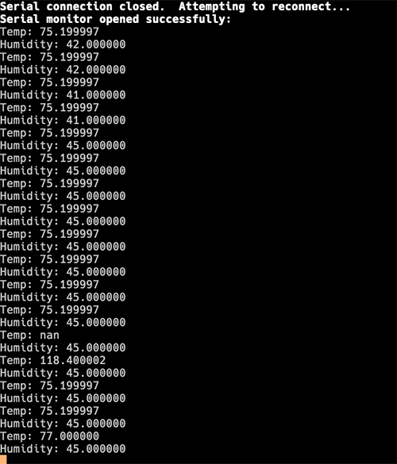

Now that you've connected the sensor, let's sprinkle in some Particle goodness.

### Storing sensor data in Particle variables

1. To use the Particle variable primitive, you need global variables to access. Start by moving the first line of your `loop` which declares the two environment variables (`temp` and `humidity`) to the top of your project, outside of the `setup` and `loop` functions. 

```cpp
#include "Grove_Temperature_And_Humidity_Sensor.h"

DHT dht(D2);

int temp, humidity;

void setup() {
  // Existing setup code here
}

void loop() {
  // Existing loop code here
}
```

2. With global variables in hand, you can add Particle variables using the `Particle.variable()` method, which takes two parameters: the first is a string representing the name of the variable, and the second is the firmware variable to track. 

Add the following lines to the end of your `setup` function:

```cpp
Particle.variable("temp", temp);
Particle.variable("humidity", humidity);
```

3. Flash this code to your device and, when the Argon comes back online, move on to the next step.

### Accessing Particle variables from the Console

1. To view the variables you just created, open the Particle Console by navigating to [console.particle.io](https://console.particle.io) and clicking on your device.

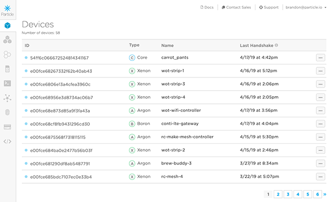

2. On the device detail page, your variables will be listed on the right side, under Device Vitals and Functions.

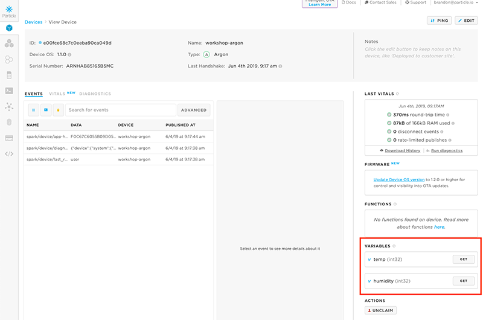

3. Click the "Get" button next to each variable to see its value.

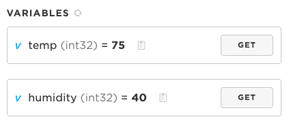

Now that you've mastered Particle variables for reading sensor data, let's look at how you can use the function primitive to trigger an action on the device. 

## Working with Particle Functions and the Chainable LED

As with Particle variables, the [function](https://docs.particle.io/reference/device-os/firmware/photon/#particle-function-) primitive exposes our device to the Particle Device Cloud. Where variables expose state, functions expose actions.

In this section, you'll use the Grove Chainable LED and the `Particle.function` command to take a heart-rate reading, on demand.

### Connect the Chainable LED

1. Open the bag containing the chainable LED and take one connector out of the bag.

2. Connect one end of the Grove connector to the chainable LED on the side marked IN (the left side if you're looking at the device in a correct orientation).

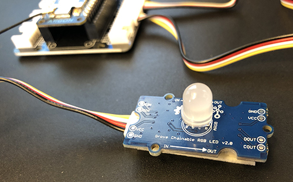

3. Plug the other end of the connector into the Shield port labeled `A4`.

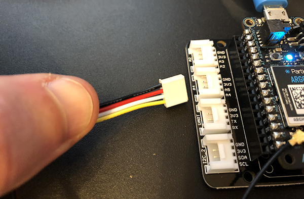

4. As with the Temp and Humidity sensor, you'll need a library to help us program the chainable LED. Using the same process you followed in the last module, add the `Grove_ChainableLED` library to your project in Particle Workbench.

5. Once the library has been added, add an include and  create an object for the ChainableLED class at the top of your code file. The first two parameters specify which pin the LED is wired to, and the third is the number of LEDs you have chained together, just one in our case.

```cpp
#include "Grove_ChainableLED.h"
ChainableLED leds(A4, A5, 1);
```

6. Now, initialize the object in your `setup` function. You'll also set the LED color to off after initialization.

```cpp
leds.init();
leds.setColorHSB(0, 0.0, 0.0, 0.0);
```

With our new device set-up, you can turn it on in response to Particle function calls!

### Turning on the Chainable LED

1. Start by creating an empty function to toggle the LED. Note the function signature, which returns an `int` and takes a single `String` argument.

```cpp
int toggleLed(String args) {
}
```

2. In the `toggleLED` function, add a few lines turn the LED red, delay for half a second, and then turn it off again.

```cpp
leds.setColorHSB(0, 0.0, 1.0, 0.5);

delay(1000);

leds.setColorHSB(0, 0.0, 0.0, 0.0);

return 1;
```

3. Now, let's call this from the loop to test things out. Add the following line before the delay.

```cpp
toggleLed("");
```

4. The last step is to flash this new code to your Argon. Once it's updated, the LED will blink red every 10 seconds.

### Setting-up Particle Functions for remote execution

Now, let's modify our firmware to make the LED function a Particle Cloud function.

1. Add a `Particle.function` to the `setup` function.

```cpp
Particle.function("toggleLed", toggleLed);
```

`Particle.function` takes two parameters, the name of the function for display in the console and remote execution, and a reference to the firmware function to call.

2. Remove the call to `toggleLed` from the `loop`.

### Calling Particle functions from the console

1. Flash the latest firmware and navigate to the device dashboard for your Argon at [console.particle.io](https://console.particle.io). On the right side, you should now see your new function.

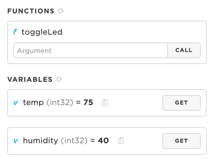

2. Click the "Call" button and watch the chainable LED light up at your command!

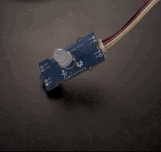

## Working with Particle Publish & Subscribe plus a light sensor

For the final section of this lab, you're going to explore the [Particle `pub/sub` primitives](https://docs.particle.io/reference/device-os/firmware/photon/#particle-publish-), which allows inter-device (and app!) messaging through the Particle Device Cloud. You'll use the light sensor and publish messages to all listeners when light is detected.

### Connect the Light sensor

To connect the light sensor, connect a Grove cable to the port of the sensor. Then, connect the other end of the cable to the Analog `A0/A1` port on the Grove shield.

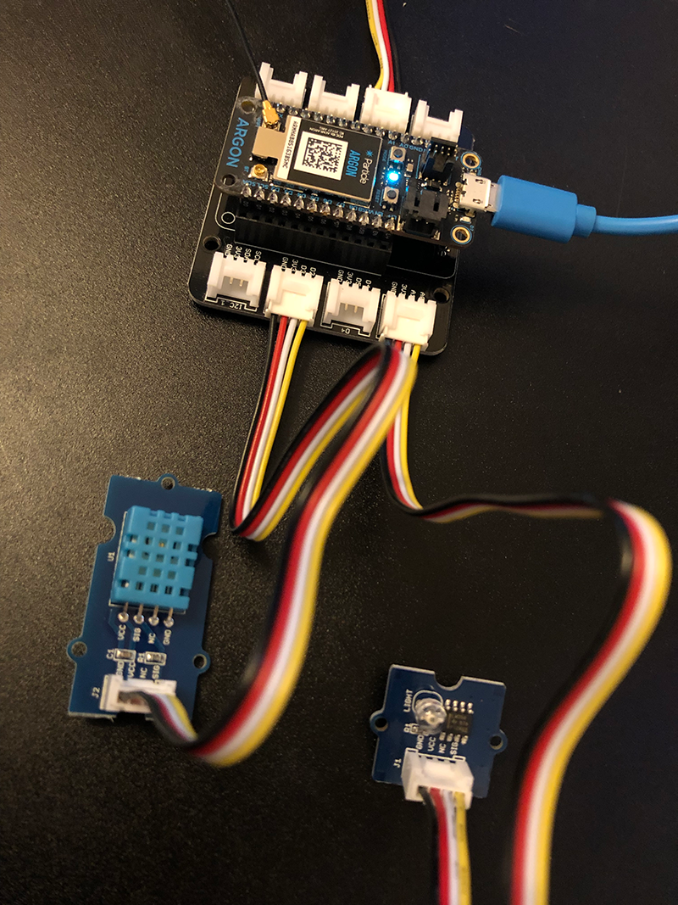

### Using the sensor 

Let's set-up the sensor on the firmware side so that you can use it in our project. The light sensor is an analog device, so configuring it is easy, no library needed.

1. You'll need to specify that the light sensor is an input using the `pinMode` function. Add the following line to your `setup` function:

```cpp
pinMode(A0, INPUT);
```

2. Let's also add a global variable to hold the current light level detected by the sensor. Add the following before the `setup` and `loop` functions:

```cpp
double currentLightLevel;
```

3. Now, in the `loop` function, let's read from the sensor and use the `map` function to translate the analog reading to a value between 0 and 100 that you can work with.

```cpp
double lightAnalogVal = analogRead(A0);
currentLightLevel = map(lightAnalogVal, 0.0, 4095.0, 0.0, 100.0);
```

4. Now, let's add a conditional to check the level and to publish an event using `Particle.publish` if the value goes over a certain threshold.

```cpp
if (currentLightLevel > 50) {
  Particle.publish("light-meter/level", String(currentLightLevel), PRIVATE);
}
```

5. Flash the device and open the Particle Console dashboard for your device. Shine a light on the sensor and you'll start seeing values show up in the event log.

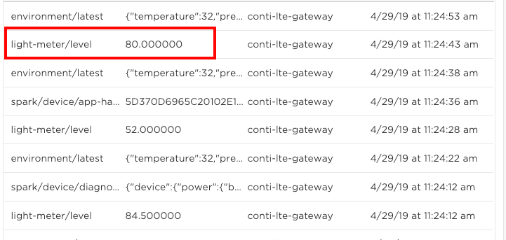

### Subscribing to published messages from the Particle CLI

In addition to viewing published messages from the console, you can subscribe to them using `Particle.subscribe` on another device, or use the Device Cloud API to subscribe to messages in an app. Let's use the Particle CLI to view messages as they come across.

1. Open a new terminal window and type `particle subscribe light-meter mine`

2. Shine a light on the light sensor and wait for readings. You should see events stream across your terminal. Notice that the `light-meter` string is all you need to specify to get the `light-meter/latest` events. By using the forward slash in events, can subscribe via greedy prefix filters. 

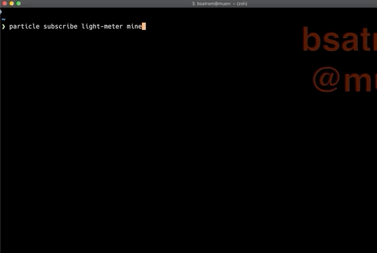

## Working with Bluetooth on Particle Devices

For the last section of this lab, we'll explore using BLE to advertise data from your device. Specifically, we'll use BLE to adversise the power and battery state of your Argon, which you'll then read from a browswer using Web BLE and Chrome.

### Using Bluetooth with Particle Gen3 Devices

1. To use Bluetooth with a Gen3 device, you'll need to be running Device OS version 1.3.0 or greater. To set this in Workbench, open the command palette (SHIFT + CMD/CTRL + P), select the "Configure Project for Device" option and select version "deviceOS@1.3.0" or newer.

2. Next, you'll want to install a new library to help with getting power and battery info from your device. Open the command palette, select the "Install Library" command and enter "DiagnosticsHelperRK" into the textbox. Hit enter and the library will be installed.

3. At the top of your project, add an include for the DiagnosticsHelper library.

```cpp
#include "DiagnosticsHelperRK.h"
```

4. Next, add some global variables to handle timing for updating the battery state outside of the `setup` and `loop` functions.

```cpp
const unsigned long UPDATE_INTERVAL = 2000;
unsigned long lastUpdate = 0;
```

5. Now, add a UUID for the battery service, and three characteristic objects to represent battery state, power source, and battery level. The service UUID is arbitrary and you should change it from the default below using a UUID generator like the one [here](https://www.uuidgenerator.net/). Keep track of the UUID you create here  because you'll need it in the next section as well. The Service UUIDs should remain unchanged.

```cpp
// Private battery and power service UUID
const BleUuid serviceUuid("5c1b9a0d-b5be-4a40-8f7a-66b36d0a5176"); // CHANGE ME

BleCharacteristic batStateCharacteristic("batState", BleCharacteristicProperty::NOTIFY, BleUuid("fdcf4a3f-3fed-4ed2-84e6-04bbb9ae04d4"), serviceUuid);
BleCharacteristic powerSourceCharacteristic("powerSource", BleCharacteristicProperty::NOTIFY, BleUuid("cc97c20c-5822-4800-ade5-1f661d2133ee"), serviceUuid);
BleCharacteristic batLevelCharacteristic("batLevel", BleCharacteristicProperty::NOTIFY, BleUuid("d2b26bf3-9792-42fc-9e8a-41f6107df04c"), serviceUuid);
```

6. Next, create a function to configure and set-up BLE advertising from your device. This snippet will add the three characteristics you defined above, as well as the service UUID you specified, and will advertise itself as a connectable device.

```cpp
void configureBLE()
{
  BLE.addCharacteristic(batStateCharacteristic);
  BLE.addCharacteristic(powerSourceCharacteristic);
  BLE.addCharacteristic(batLevelCharacteristic);

  BleAdvertisingData advData;

  // Advertise our private service only
  advData.appendServiceUUID(serviceUuid);

  // Continuously advertise when not connected
  BLE.advertise(&advData);
}
```

7. At the end of your `setup` function, call the function you just created.

```cpp
configureBLE();
```

### Refactoring out the blocking delay

Next, let's modify the `loop` function. We'll start by refactoring our firmware to remove the `delay` in the loop. While the delay approach is common when getting started with creating embedded applications, it's a blocking operation. This means that any calls you make to the device during a delay may timeout before being received.

One common way to write periodic code without using `delay` is to use the built-in `millis()` function and keep track of the elapsed time between the last time you performed an operation (like a temp check) and the wait time between operations.

1. First, let's add some global variables to hold the last check time and an interval. Add the following to the top of your project, outside of the `setup` and `loop`.

```cpp
const unsigned long UPDATE_INTERVAL = 2000;
unsigned long lastUpdate = 0;
```

2. Now, in the `loop`, add a local variable to hold the current time elapsed. The `millis()` function returns the number of milliseconds that have elapsed since your device began running the current program. 

```cpp
unsigned long currentMillis = millis();
```

3. Next, remove the `delay` at the end of your loop function. Then, wrap the rest of the code with an if statement to see if the `UPDATE_INTERVAL` time has elapsed.

Make sure you also update the `lastUpdate` variable to the current `millis` time or this `if` statement will never evaluate to `true` after the first time it runs.

```cpp
if (currentMillis - lastUpdate >= UPDATE_INTERVAL)
{
  lastUpdate = millis();

  /* rest of Loop code here */ 
}
```

Your `loop` should now look like this:

```cpp
void loop()
{
  unsigned long currentMillis = millis();

  if (currentMillis - lastUpdate >= UPDATE_INTERVAL)
  {
    lastUpdate = millis();

    temp = (int)dht.getTempFarenheit();
    humidity = (int)dht.getHumidity();

    Serial.printlnf("Temp: %f", temp);
    Serial.printlnf("Humidity: %f", humidity);

    double lightAnalogVal = analogRead(A0);
    currentLightLevel = map(lightAnalogVal, 0.0, 4095.0, 0.0, 100.0);

    if (currentLightLevel > 50)
    {
      Particle.publish("light-meter/level", String(currentLightLevel), PRIVATE);
    }
  }
}
```

4. Now, let's add our BLE logic to the `loop`, after the `currentLightLevel` if statement. In this code, we check to see if another device (a peripheral) is connected to our Argon. If so. we'll use the diagnostics library to get the current power source, battery state and charge, and set those values to our characteristics, so the connected client can read them.

```cpp
if (BLE.connected())
{
  uint8_t powerSource = (uint8_t)DiagnosticsHelper::getValue(DIAG_ID_SYSTEM_POWER_SOURCE);
  powerSourceCharacteristic.setValue(powerSource);

  uint8_t batState = (uint8_t)DiagnosticsHelper::getValue(DIAG_ID_SYSTEM_BATTERY_STATE);
  batStateCharacteristic.setValue(batState);

  uint8_t batLevel = (uint8_t)(DiagnosticsHelper::getValue(DIAG_ID_SYSTEM_BATTERY_CHARGE) >> 8);
  batLevelCharacteristic.setValue(batLevel);
}
```

5. And that's all you need on the Argon side. Flash the latest firmware to your device and move on to the next step!

### Viewing Bluetooth data with Web BLE on Chrome

There are a number of methods by which you can connect to your BLE-powered Argon. You could use a mobile app (like [Bluefruit](https://apps.apple.com/us/app/adafruit-bluefruit-le-connect/id830125974) from Adafruit), or another Particle 3rd Gen device. You can also use a browser that supports Web BLE, like Chrome, which will do in this section. At the time this lab ws created, Chrome is the only desktop browser that supports Web BLE, so you'll need to have that browser installed to 

1. Clone the [demo web app](https://github.com/bsatrom/particle-web-ble) for this project to your machine using a terminal window

```bash
$ git clone https://github.com/bsatrom/particle-web-ble
```

2. Open the project in your editor of choice, and modify the following snippet in the `src/scripts/ble.js` file to match the Service UUID you specified in your Argon code above. This code scans for available devices that match a specific UUID, so if you changed it, you should only see your device when running the app.

```js
const device = await navigator.bluetooth.requestDevice({
  filters: [{ services: ['5c1b9a0d-b5be-4a40-8f7a-66b36d0a5176'] }] // CHANGE ME
});
```

3. In a terminal window, run `npm run serve` to build and run the web app locally. Once the build completes, open a new browser tab or window with the URL specified in the terminal window.


4. Click on the "Scan" Button. A pop-up will appear as Chrome scans for devices. Once your device appears, click on it and click the "Pair" button. 

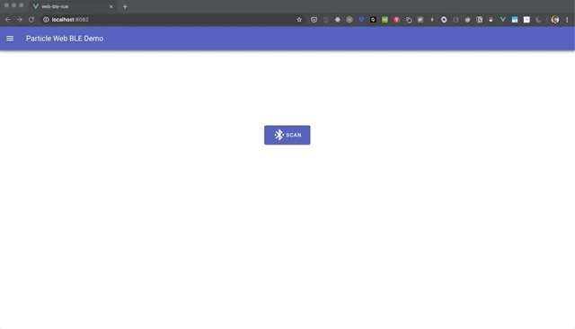

In the local app, the screen will update as the connection is made and data is retrieved from the device.

5. Now, grab a LiPo battery from one of the lab proctors, plug it into the JST port on your Argon and unplug your Argon from USB power. Notice how the web app updates automatically as your Argon advertises state changes.

## Bonus: Working with Mesh Publish and Subscribe

If you've gotten this far and still have some time on your hands, how about some extra credit? So far, everything you've created has been isolated to a single device, a Particle Argon. Particle 3rd generation devices come with built-in mesh-networking capabilities.

If you have a Xenon on hand, why not try creating a mesh network with your Argon and adding the Xenon by [following this lab in the Particle docs](https://docs.particle.io/workshops/mesh-101-workshop/mesh-messaging/)? Then, use `Mesh.publish` and `subscribe` to add some interactivity between your two devices, like taking a heart-rate reading when the `SETUP` button on the Xenon is pressed, or lighting up the `D7` LED on the Xenon each time the barometer sensor takes a reading.

## Appendix: Grove sensor resources

This section contains links and resources for the Grove sensors included in the Grove Starter Kit for Particle Mesh.

### Button

- Sensor Type: Digital
- [Particle Documentation](https://docs.particle.io/datasheets/accessories/mesh-accessories/#button)
- [Seeed Studio Documentation](https://www.seeedstudio.com/Grove-Button-p-766.html)

### Rotary Angle Sensor

- Sensor Type: Analog
- [Particle Documentation](https://docs.particle.io/datasheets/accessories/mesh-accessories/#rotary-angle-sensor)
- [Seeed Studio Documentation](https://docs.particle.io/datasheets/accessories/mesh-accessories/#button)


### Ultrasonic Ranger

- Sensor Type: Digital
- [Particle Firmware Library](https://build.particle.io/libs/Grove_Ultrasonic_Ranger/1.0.0/tab/Ultrasonic.cpp)
- [Particle Documentation](https://docs.particle.io/datasheets/accessories/mesh-accessories/#ultrasonic-ranger)
- [Seeed Studio Documentation](http://wiki.seeedstudio.com/Grove-Ultrasonic_Ranger/)

### Temperature and Humidity Sensor

- Sensor Type: Digital
- [Particle Firmware Library](https://build.particle.io/libs/Grove_Temperature_And_Humidity_Sensor/1.0.6/tab/Seeed_DHT11.cpp)
- [Particle Documentation](https://docs.particle.io/datasheets/accessories/mesh-accessories/#temperature-and-humidity-sensor)
- [Seeed Studio Documentation](http://wiki.seeedstudio.com/Grove-TemperatureAndHumidity_Sensor/)

### Light sensor

- Sensor Type: Analog
- [Particle Documentation](https://docs.particle.io/datasheets/accessories/mesh-accessories/#light-sensor-v1-2)
- [Seeed Studio Documentation](http://wiki.seeedstudio.com/Grove-Light_Sensor/)

### Chainable LED

- Sensor Type: Serial
- [Particle Firmware Library](https://build.particle.io/libs/Grove_ChainableLED/1.0.1/tab/ChainableLED.cpp)
- [Particle Documentation](https://docs.particle.io/datasheets/accessories/mesh-accessories/#chainable-rgb-led)
- [Seeed Studio Documentation](http://wiki.seeedstudio.com/Grove-Chainable_RGB_LED/)

### Buzzer

- Sensor Type: Digital
- [Particle Documentation](https://docs.particle.io/datasheets/accessories/mesh-accessories/#buzzer)
- [Seeed Studio Documentation](http://wiki.seeedstudio.com/Grove-Buzzer/)

### 4-Digit Display

- Sensor Type: Digital
- [Particle Firmware Library](https://build.particle.io/libs/Grove_4Digit_Display/1.0.1/tab/TM1637.cpp)
- [Particle Documentation](https://docs.particle.io/datasheets/accessories/mesh-accessories/#4-digit-display)
- [Seeed Studio Documentation](http://wiki.seeedstudio.com/Grove-4-Digit_Display/)
