# Chapter 3: Using Particle Integrations and Azure IoT Central

| **Project Goal**            | Use Particle Integrations to connect your app to Azure IoT Central.                                                                                        |
| --------------------------- | ------------------------------------------------------------------------------------------------------------------------------------------------------------------------- |
| **What you’ll learn**       | Working with Particle Integrations, Integrating Particle projects with Azure IoT Central |
| **Tools you’ll need**       | Particle Workbench, an [Azure](https://portal.azure.com?WT.mc_id=webinar-particle-pdecarlo) account, a Particle Argon, and the Grove Starter Kit for Particle Mesh, a Particle Debugger.                                                                                                            |
| **Time needed to complete** | 60 minutes                                                                                                                                                                |

In this session, you're going to explore the power of Particle integrations, integrate your project with Microsoft's Azure IoT Central and build dashboards to visualize your data. If you get stuck at any point during this session, [click here for the completed, working source](https://github.com/bsatrom/particle-azure-workshop-2019/blob/master/labs/lab3/src/lab3.cpp).

First, let's take a brief look at the Particle CLI and Device Cloud API.

## Exploring the Particle CLI and Device Cloud API

### The Particle CLI

1.  If you haven't already, [install the Particle CLI](https://docs.particle.io/guide/tools-and-features/cli/photon/). Open a terminal window and type the following command:

```bash
bash <( curl -sL https://particle.io/install-cli )
```

2.  Type `particle login` and enter your Particle account email and password when prompted.

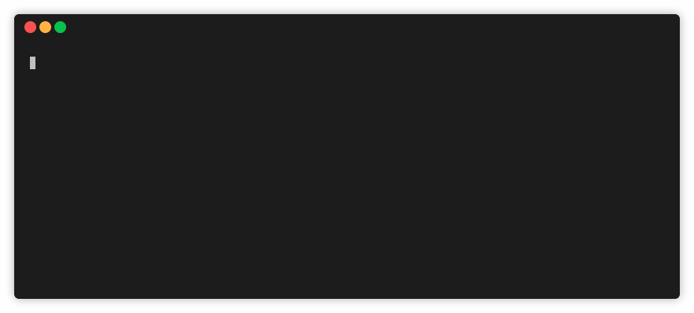

3.  Once you're logged in, type `particle list` to see your list of online devices.

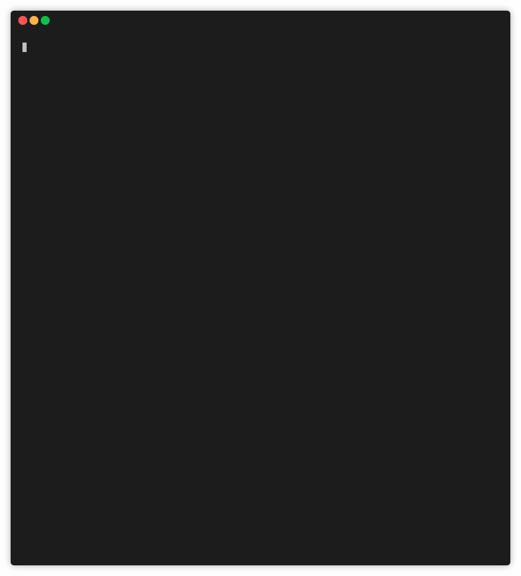

4.  The device you've been using for this workshop has two variables and one function. Get the value of the `temp` variable with the command `particle get temp`.


5.  You can also call one of the two functions to light up the yellow or blue LED button. Type the command `particle call <your-device-name> toggleLed` in the terminal. Run the same command again to turn the light off.

### The Particle Device Cloud API

Behind the scenes, every interface that Particle provides to work with devices, from the Console, to mobile apps, SDKs, and the CLI, they all talk through a RESTful Device Cloud API. You can even call yourself, directly.

_The next few steps assume you have cURL installed on your machine. If you don't have this command-line utility on your machine, you can download and install it [here](https://curl.haxx.se/download.html) or use a GUI-based tool like [Postman](https://www.getpostman.com/)._

1.  First, you'll need to obtain an access token from the CLI. Type `particle token list` to view the tokens associated with your account. The first one listed is your `user` token, and can be used to access the Device Cloud API. If no tokens are listed, generate a new one with `particle token new`.

2.  With your token and Device ID in hand, type the following cURL command into a terminal window, replacing the text below in `< >` with your information.

```bash
curl https://api.particle.io/v1/devices?access_token=<your token>
```

By default, the response will generate a wall of text in your terminal. If you have Python 2.6+ installed on your machine, you can pipe the output to the `json.tool` and get pretty-printed JSON.

```bash
curl https://api.particle.io/v1/devices\?access_token\=<your token>
| python -m json.tool
```


3.  For this next command, you need the Device ID of the Photon attached to your badge. You can find that in the console or via the `particle list` CLI command.

4.  Let's call the `toggleLed` function using the Device Cloud API. Type the following, again replacing the text below in `< >` with your information.

```bash
curl https://api.particle.io/v1/devices/<device id>/toggleLED \
     -d access_token=<your token>
```

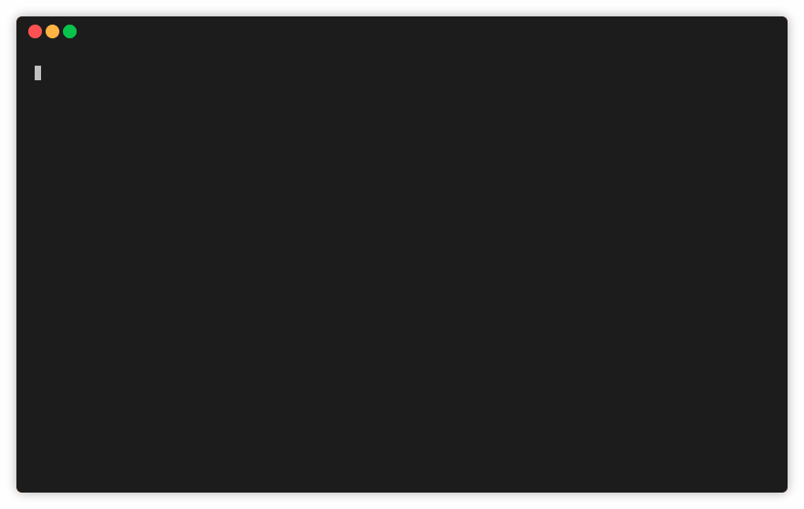

You've now explored a number of ways that you can interface with the Particle Device cloud and your connected devices! Now, let's go beyond the Particle ecosystem and explore some of the ways that you can integrate with other 3rd party services, and backhaul your data into other cloud services.


## Integrating with Azure IoT Central

In this section, you'll explore Azure IoT Central, create a middleware app to broker a connection between Particle and Azure, ingest data, and add simple visualizations. First, you'll need to set-up an IoT Central instance.

### Setting up Azure IoT Central

1.  Sign up for an [Azure Account](https://azure.microsoft.com/en-us/get-started?WT.mc_id=webinar-particle-pdecarlo), or sign in if you already have one.

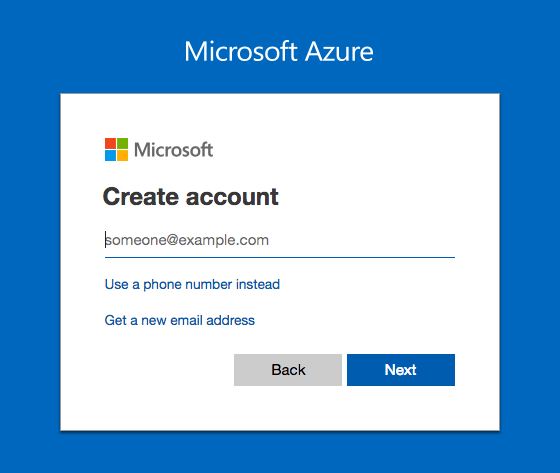

2.  Navigate to the [Build Your IoT Application](https://apps.azureiotcentral.com/build?WT.mc_id=webinar-particle-pdecarlo) section of IoT Central and select the "Custom App" template.

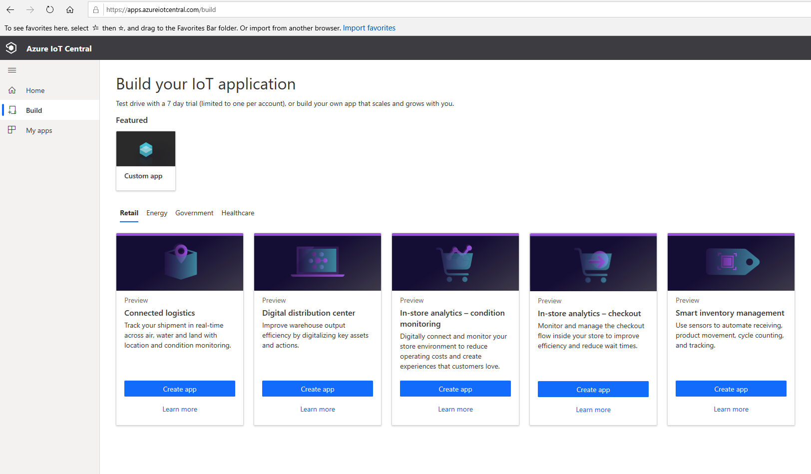

3. Give the IoT Central Application a name and URL (both must be globally unique). Then, select "Custom application" for the application template,  choose a pricing tier, select a subscription, and choose "United States" for the location. Finally, click "Create" and wait for the deployment to complete.

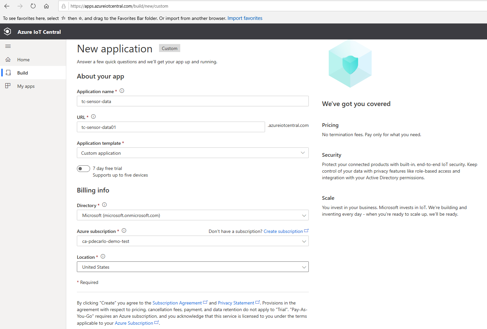

4. When the deployment completes, you will be navigated to the newly deployed IoT Central Instance.

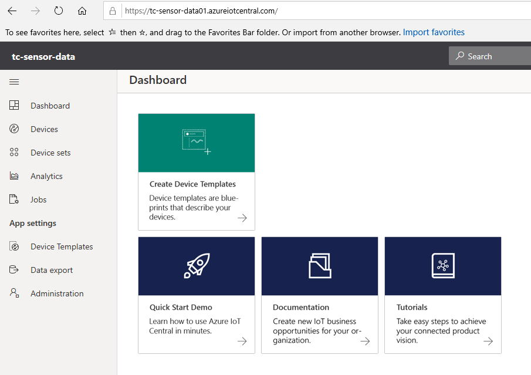

5. If you need to find the url to your IoT Central instance, you can view a list of all of the IoT Central instances for your subscription at [https://apps.azureiotcentral.com/myapps](https://apps.azureiotcentral.com/myapps?WT.mc_id=webinar-particle-pdecarlo)

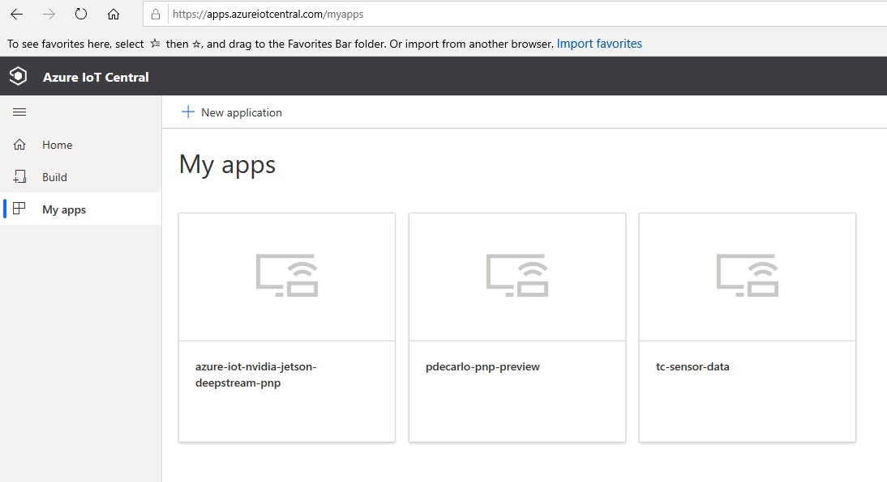

### Adding Device Telemetry and Commands

6. Click the "Create Device Templates" card on the home page. Click "Custom" in the next screen.

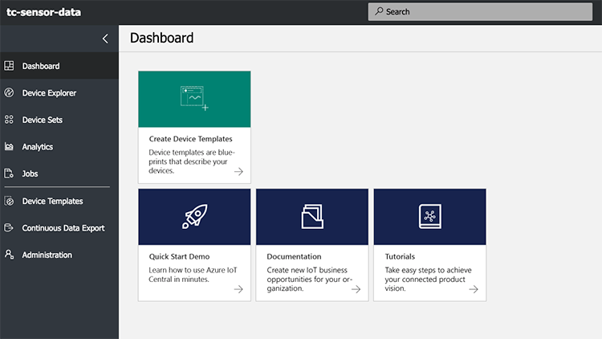

7. Name the template "Particle Argon" and click "Create."

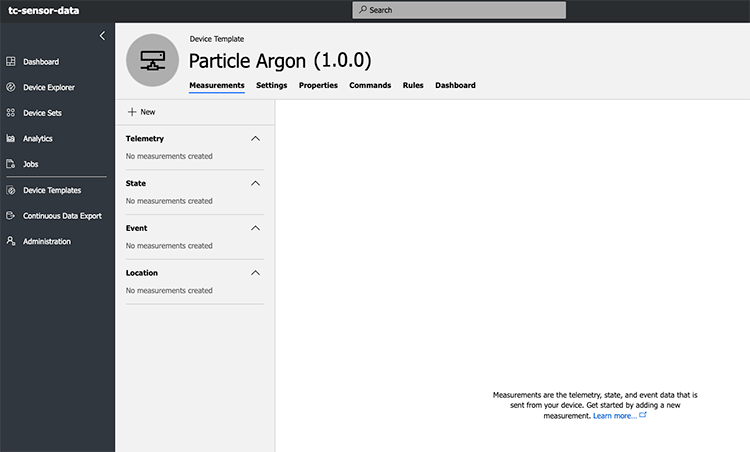

8. Click the "New" menu option and select "Telemetry."

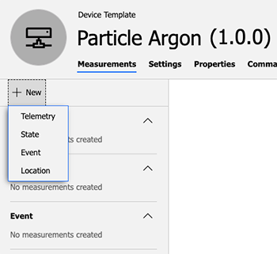

9. Fill in the telemetry options using the data below and click "Save."

| Display Name | Field Name | Units | Minimum Value | Maximum Value | Decimal Places |
| ------------ | ------------ | ------------ | ------------ | ------------ | ------------ | 
| Temperature | temp | degF | 0 | 110 | 0 |

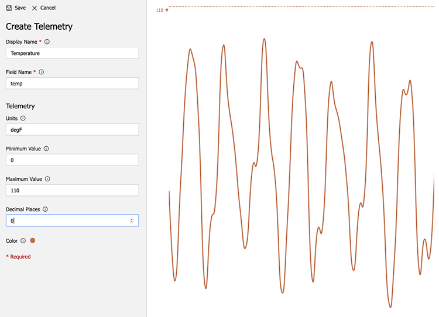

10. Repeat steps 8-9 for humidity and light, using the values below.

| Display Name | Field Name | Units | Minimum Value | Maximum Value | Decimal Places |
| ------------ | ------------ | ------------ | ------------ | ------------ | ------------ | 
| Humidity | humidity | % | 0 | 100 | 0 |
| Light Level | light | % | 0 | 100 | 2 |

Once done, you'll start to see simulated data show up on the right side of the screen.

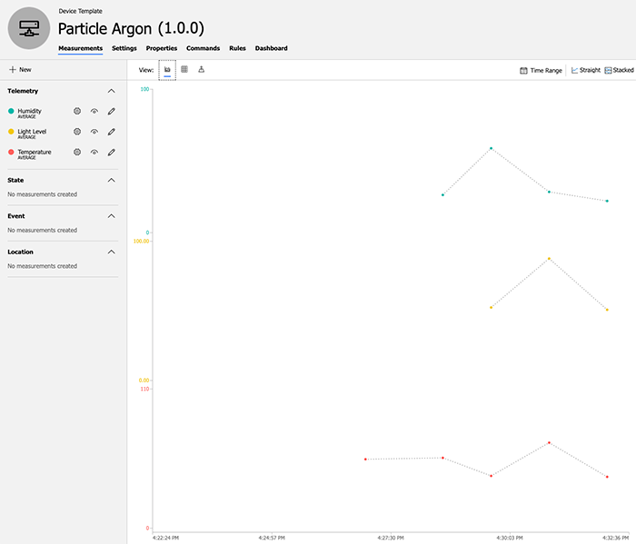

### Creating the Azure IoT Central Device Bridge Middleware

To integrate Particle devices with IoT Central, you’ll need to set-up two things:

1. Middleware (a public API or serverless app) to catch webhooks from Particle and forward data into IoT Central.
2. A Webhook integration to forward Particle events to your middleware.

The middleware solution can be anything you like, and you can roll it yourself, but if, like us, you don’t enjoy spinning up sites from scratch just for fun, the Azure team provides an [Azure IoT Central Device Bridge](https://github.com/Azure/iotc-device-bridge) template solution with one-click deployment into your Azure account.

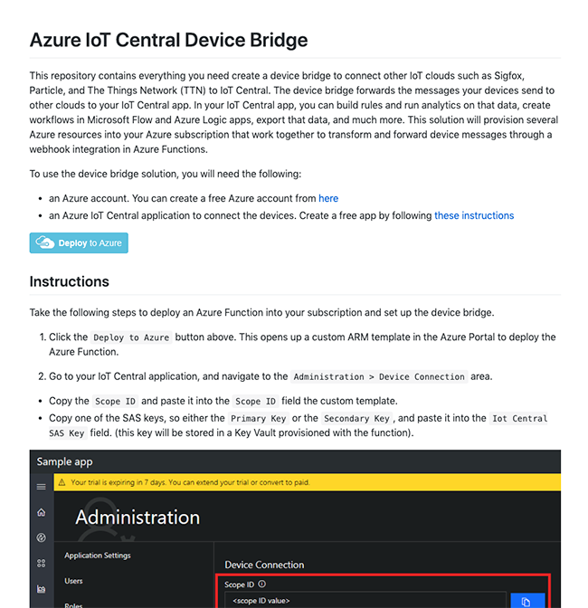

1. Navigate to the README for the project and click on the Deploy to Azure button. This opens up an Azure Marketplace template that’s preconfigured to add 4 resources to your Azure account: An Azure App Service and App Service plan for hosting the middleware app, a Key vault to hold your IoT Central tokens, and a Storage account.

2. To complete the deployment from the template, select a subscription, resource group, and location. Then, provide the Scope ID and SAS Key for your Central application. These can be obtained from the `Administration > Device Connection` screen of your IoT Central application.

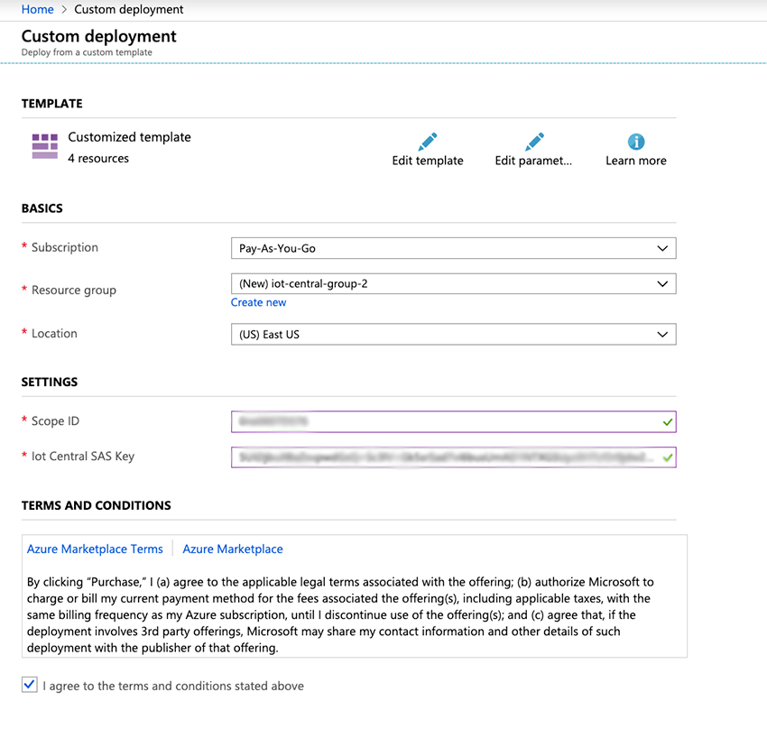

3. Once the deployment is done, you’ll have an App Service that can securely forward messages to your IoT Central instance. The App Service deployed by this template is a Node.js app, so the next step is to open your function app in the portal, run `npm install` to install dependencies and restart the app.

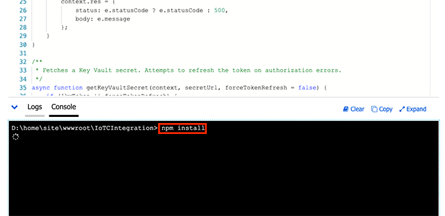

4. Once the app restarts, grab the function URL to set-up the webhook on the Particle side. For additional info on this or the last few steps, check out the [`README`](https://github.com/Azure/iotc-device-bridge/blob/master/README.md) for the device bridge project.

Now you're ready to create an integration between Particle and your middleware.

### Creating the Particle Integration

1. Head to the [Particle Console](https://console.particle.io/) and click on the integrations icon on the left gutter navigation.

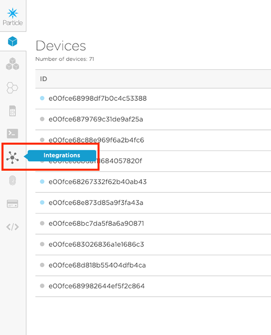

2. Click the New Integration card, and then click the Webhook option. Be sure not to select the Azure IoT Hub integration.

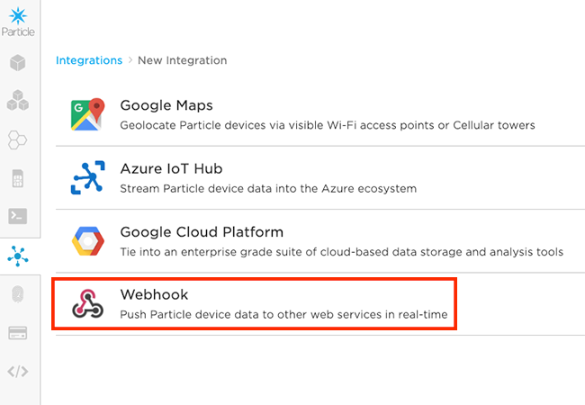

3. In the Webhook builder, enter the name of the event you want to listen for on the particle side. Let's use `env-vals` since that's what we'll use in firmware in the next section. Then, paste in the URL from the Azure App Service function you created in the last step. Leave the request type unchanged and select JSON for the request format. In the last drop-down, select the Particle device you plan to publish events from.

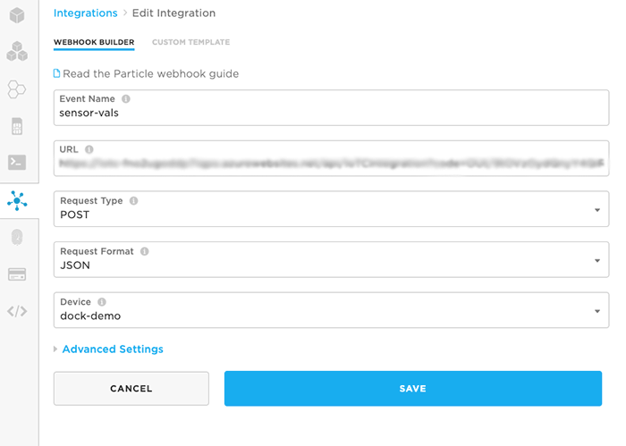

4. In order to get the request payload into a format that your App Service middleware can ingest and forward to IoT Central, you’ll need to customize the default webhook that Particle sends. So, before clicking Create Webhook, click the Advanced Settings link to reveal the request form fields. Click the Custom option button. Copy the snippet below and paste it into the textarea. You may get a `bad string` warning from the built-in validator, but you can ignore this message.

```json
{
  "device": {
    "deviceId": "{{{PARTICLE_DEVICE_ID}}}"
  },
  "measurements": {{{PARTICLE_EVENT_VALUE}}}
}
```

5. After you’ve changed the payload, click Create Webhook. Now you’re ready to start publishing events through the Particle Device Cloud.

### Publishing Sensor Values from Firmware

**_Skip this section if you completed the BLE Bonus section in Lab 2._**

Now, let's modify our firmware to publish Sensor values. First, we'll refactor our firmware to remove the `delay` in the loop. While the delay approach is common when getting started with creating embedded applications, it's a blocking operation. This means that any calls you make to the device during a delay may timeout before being received.

One common way to write periodic code without using `delay` is to use the built-in `millis()` function and keep track of the elapsed time between the last time you performed an operation (like a temp check) and the wait time between operations.

1. First, let's add some global variables to hold the last check time and an interval. Add the following to the top of your project, outside of the `setup` and `loop`.

```cpp
unsigned long previousCheckMillis = 0;
unsigned long checkInterval = 5000;
```

2. Now, in the `loop`, add a local variable to hold the current time elapsed. The `millis()` function returns the number of milliseconds that have elapsed since your device began running the current program. 

```cpp
unsigned long currentMillis = millis();
```

3. Next, remove the `delay` at the end of your loop function. Then, wrap the rest of the code with an if statement to see if the `checkInterval` time has elapsed.

Make sure you also update the `previousCheckMillis` variable to the current `millis` time or this `if` statement will never evaluate to `true` after the first time it runs.

```cpp
if (currentMillis - previousCheckMillis > checkInterval) { 
  previousCheckMillis = millis();

  /* rest of Loop code here */ 
}
```

Your `loop` should now look like this:

```cpp
void loop()
{
  unsigned long currentMillis = millis();

  if (currentMillis - previousCheckMillis > checkInterval)
  {
    previousCheckMillis = millis();

    temp = (int)dht.getTempFarenheit();
    humidity = (int)dht.getHumidity();

    Serial.printlnf("Temp: %f", temp);
    Serial.printlnf("Humidity: %f", humidity);

    double lightAnalogVal = analogRead(A0);
    currentLightLevel = map(lightAnalogVal, 0.0, 4095.0, 0.0, 100.0);

    if (currentLightLevel > 50)
    {
      Particle.publish("light-meter/level", String(currentLightLevel), PRIVATE);
    }
  }
}
```
### Publishing a payload with temp and humidity values

Now, let's send the current temp, humidity and light level using a `Particle.publish` event. You'll send a single event with all three values in a single JSON object. To do this, you'll use the `JSONParserGenerator` library.

1. Open the Workbench Command Palette (CMD+SHIFT+P or CTRL+SHIFT+P) and select the "Particle: Install Library" option.

2. In the text box, type "JsonParserGeneratorRK" and click enter.

3. At the top of your project, add an include statement:

```cpp
#include "JsonParserGeneratorRK.h"
```

4. Add a new function to your app called `createEventPayload` that takes the temp, humidity and light readings. This function will create an instance of `JsonWriterStatic` and `JsonWriterAutoObject` objects, insert key-value pairs for each reading, and then get the JSON object as a string buffer that you can send along in a `Particle.publish()` event.

```cpp
void createEventPayload(int temp, int humidity, double light)
{
  JsonWriterStatic<256> jw;
  {
    JsonWriterAutoObject obj(&jw);

    jw.insertKeyValue("temp", temp);
    jw.insertKeyValue("humidity", humidity);
    jw.insertKeyValue("light", light);
  }
}
```

5. Now, let's publish a new event, and call the `createEventPayload` function to provide a formatted JSON string for the data parameter. Add the following to the end of your `createEventPayload` function.

```cpp
Particle.publish("env-vals", jw.getBuffer(), PRIVATE);
```

6. Finally, add a call to this function at the end of your loop, just inside the end of the `if` statement.

```cpp
createEventPayload(temp, humidity, currentLightLevel);
```

7. Now, flash this new code to your firmware, and when your device comes back online, you'll see events in your Console. You can also head to the integration you created above and view status logs to make sure that your integration and middleware are properly connected.

### Associating Devices in Azure IoT Central

Before we move on to creating dashboards and seeing our data stream in, we need to let IoT Central know that our device is legit. Once you’ve added the publish logic to your firmware and flashed a device, head back to your IoT Central application and associate the device to the template you created earlier. 

1. In the Devices window, you’ll see your template, and a link for Unassociated devices. Click that link, and if you see a device in the list with a name that matches the device id of your Particle device, you’ve configured everything successfully! 

2. Click the checkbox next to the device, then click the Associate menu item on the top right. 

3. Select your template and click Associate.

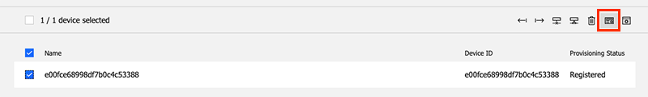

If your device is not showing up, double-check the previous configuration steps to make sure everything is correct, including the App service function URL, and that the App service is running. You can also view the response header logs for your Webhook integration in the Particle console for additional insight.

### Building Visualizations in IoT Central

To build dashboard visualizations for our Particle Device, you'll need to edit the device template. 

1. Click on the "Device Templates" menu item in IoT Central and click on your "Particle Argon" template.

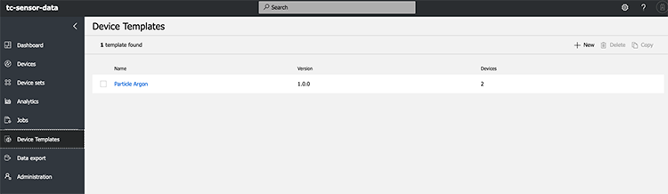

2. Click the "Dashboard" menu item.

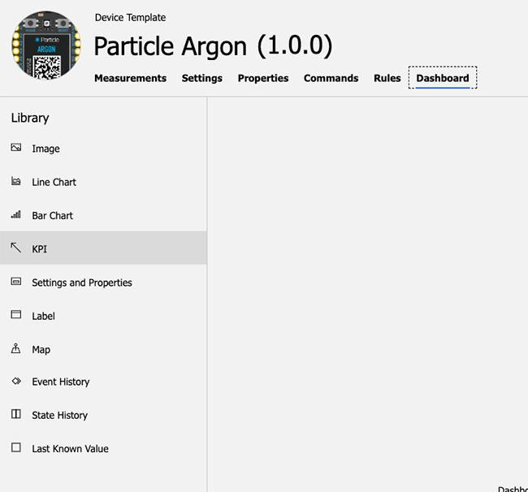

3. Click the "Last Known Value" widget. In the configuration window, set the title to "Last Temp," the measurement type to "Telemetry" and, in "Measures", click the visibility icon next to "Temperature" to select it.

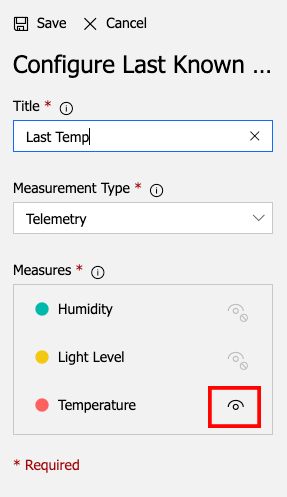

4. Click save, and the widget will show up in the main panel, with simulated data.

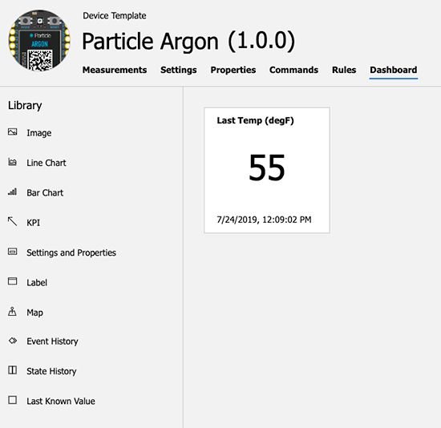

5. Repeat steps 3 and 4 for the humidity and light sensor values.

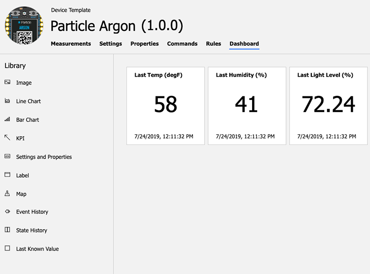

6. Now, click the "Line Chart" widget. In the configuration window, enter "Env Vals" as the title, set a time range to the past hour, and click the visibility icon for all three values to select them.

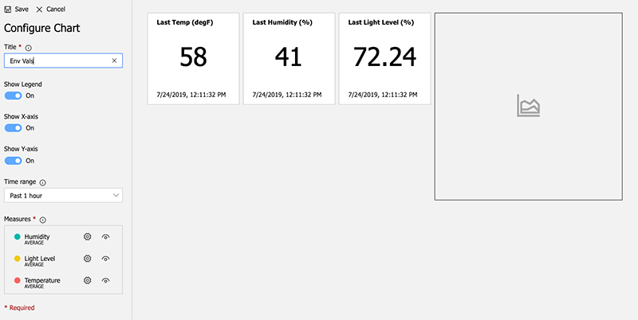

7. Click save and the chart will be created, again with simulated data.

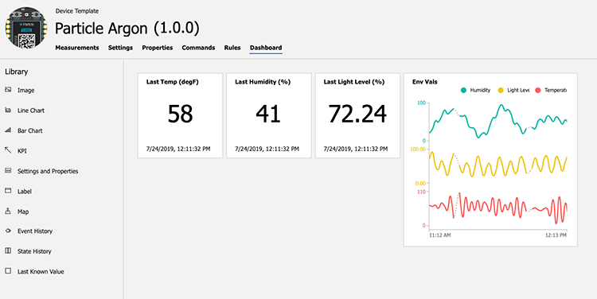

8. Click on the "Devices" left menu item, and select your real device. Click the "Dashboard" top menu item and you'll see the real values from your Particle Argon.

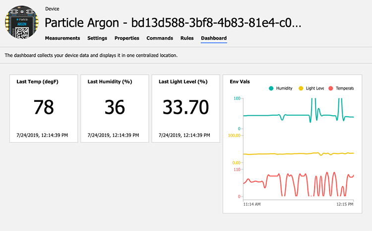

<hr/>

**Congratulations! You've completed this workshop. Now you're a Particle Master! Take a moment to pat yourself on the back and bask in your newfound IoT-commandery.**

To learn more about Azure IoT Central, check out the official documentation:
* [What is IoT Central?](https://docs.microsoft.com/en-us/azure/iot-central/preview/overview-iot-central?WT.mc_id=webinar-particle-pdecarlo)
* [What are Application Templates?](https://docs.microsoft.com/en-us/azure/iot-central/core/concepts-app-templates?WT.mc_id=webinar-particle-pdecarlo)
* [Azure IoT Central Architecture](https://docs.microsoft.com/en-us/azure/iot-central/preview/concepts-architecture?WT.mc_id=webinar-particle-pdecarlo)
* [Creating an Azure IoT Central Application](https://docs.microsoft.com/en-us/azure/iot-central/preview/quick-deploy-iot-central?WT.mc_id=webinar-particle-pdecarlo)
* [Define a Device type and Add a Device](https://docs.microsoft.com/en-us/azure/iot-central/preview/howto-set-up-template?WT.mc_id=webinar-particle-pdecarlo)
* [Monitor your Devices](https://docs.microsoft.com/en-us/azure/iot-central/preview/tutorial-create-telemetry-rules?WT.mc_id=webinar-particle-pdecarlo)

**And if you want to take your exploration further, click the "Extra" link below!**

**BEFORE YOU GO** we'd love it if you could provide feedback on this workshop. Please visit [this link](https://particleiot.typeform.com/to/JiF8xM) to rate your experience.
